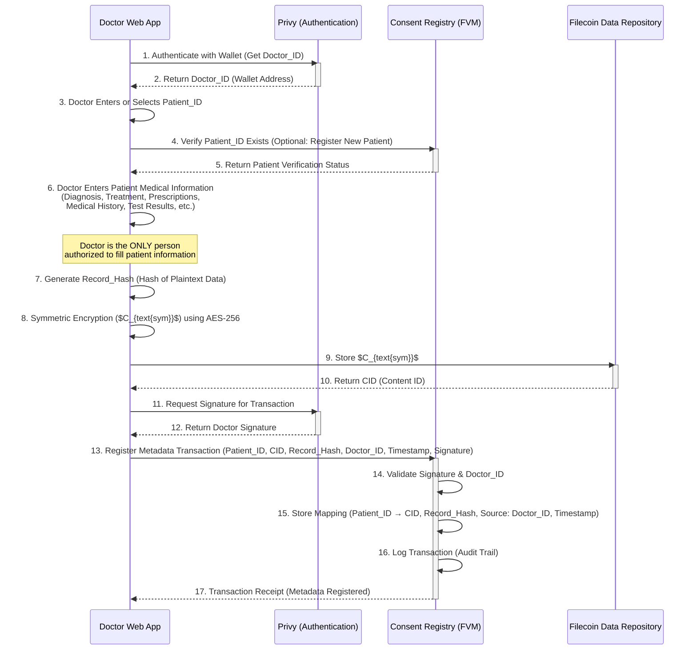
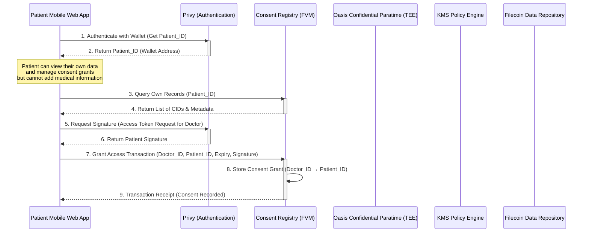
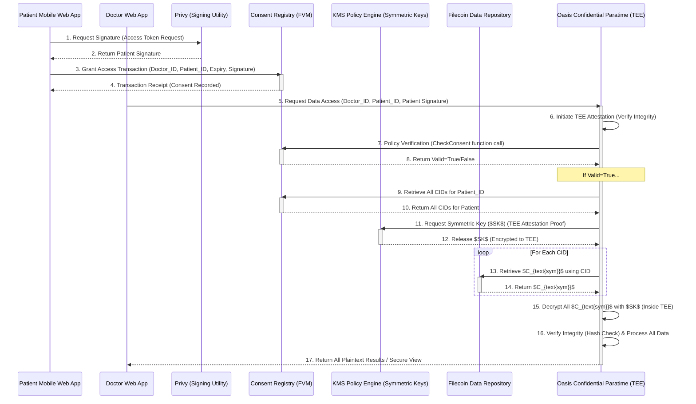

# **Sequence Diagrams: Hygiea Core Flows (Oasis Architecture)**

Project: Secure Patient Data Repository (Hygiea)  
Document Version: 1.4  
Date: November 21, 2025

## **1. Flow 1: Data Ingestion and Storage (FR 1.x)**

This sequence details how sensitive patient data is symmetrically encrypted and immutably registered within the decentralized repository. The system supports two primary flows: (a) **Doctor Web App** - doctors adding patient information (primary and only method for filling patient data), and (b) **Patient Mobile Web App** - patients viewing their own data and managing consent (patients do NOT fill their own medical information).

### **1.1 Scenario A: Doctor Web App - Doctor Adds Patient Information (Primary Data Entry)**

**Note:** The Doctor is the **only** person authorized to fill patient medical information in the system.

### **1.2 Scenario B: Patient Mobile Web App - Patient Views Data and Manages Consent**

**Note:** Patients use the mobile app to view their medical records (via consent grants) and manage access permissions. Patients **do NOT** fill their own medical information - only doctors can do that.

## **2. Flow 2: Secure Confidential Retrieval and Processing (FR 3.x)**

This sequence details the zero-trust, TEE-backed process for a doctor to access and view a record, with processing occurring inside the Oasis Confidential Paratime.

